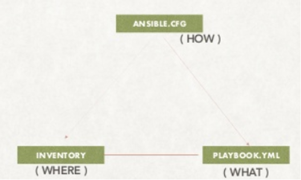

# Inventory

- Ansible works against multiple remote hosts in your infrastructure at the same time. How it does this?

- It actually does this by selecting portions of systems listed in Ansible’s Inventory file

- Default location of Inventory file is `/etc/ansible/hosts`

- You can also specify different inventory file using `–i`

- Generally, inventory files can be in different formats `YAML and ini`

- default inventory file format is `ini`

# Hosts and Groups

- Let's see some examples in `ini` format, This is the default format of Ansible

- The headings in `brackets` are group names

- Group names are basically used to classify the hosts & decide what systems you are controlling

- INI samples:

| Single host without any group |
| ------------------------------|
| mail.example.com              |

| Hosts listed under Group # Below we have classified all the web servers |
| ------------------------------------------------------------------------|
| [WEB servers]                                                           |
| one.example.com                                                         |
| two.example.com                                                         |

| Below we have classified all the DB servers |
| --------------------------------------------|
| [DB servers]                                |
| three.example.com                           |
| four.example.com                            |
| five.example.com                            |

# Hosts in multiple Group
- You can also put systems in more than one group, for instance a server could be part of both webserver and specific datacenter

- For Example, you can create groups that track

- What – Whether that host is Webserver, Database or Performance testing etc..

- Where – You can specify the datacenter region

- When – You can specify whether it is PROD, TEST or STAAGING

# Host variables

- This is called inventory variables (or) host variables

- Setting inventory variables in the inventory file is the easiest way

- For instance, suppose these hosts have different usernames and ports

  [webservers]
  server1.example.com   ansible_port=5000   ansible_user=oracle
  server2.example.com   ansible_port=5001   ansible_user=mysql

# Tips to manage inventory file efficiently

- If you need to add many hosts with similar patterns, do like below rather than listing each hostname

  [webservers]
  www[01:50].example.com

# How, What & Where?

- The below image clearly shows how ansible works

- `ANSIBLE.CFG` file is going to instruct ansible how to work

- `PLAYBOOK` is to hold the instructions of what to do

- `INVENTORY` has the information of where to do

