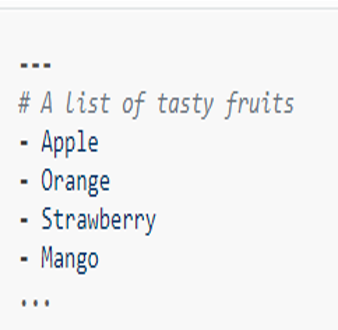
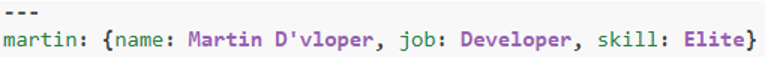

# why yaml

- YAML – Yet Another Markup Language

- We use YAML because it is easier for humans to read and write than other common data formats like XML or JSON

- We use `.yml` as an extension for configuration file or scripts written in YAML language

# Yaml basics

- All YAML files (regardless of their association with Ansible or not) can optionally begin with [---] and end with […]

- This is part of the YAML format and indicates the start and end of a document

- Example :

  

- Here you can see all the members of a list are eventually beginning with a dash and a space “-”

# Dictionary Representation

- Ansible allows you to represent dictionary format.

- It can declare in very simple form key: value [The colon must be followed by a space]

- In below example you can see how an employee record is represented in YAML.

- Martine is an employee, and you can see how his details are registered dictionary format.

  

- More complicated data structure are also possible

  

- Dictionaries and lists can also be represented in an abbreviated form if you really want it to be

  

- We can also use Boolean values(true/false) in several forms

  

- You can see the complete combinations below of what we have learned so far

  
