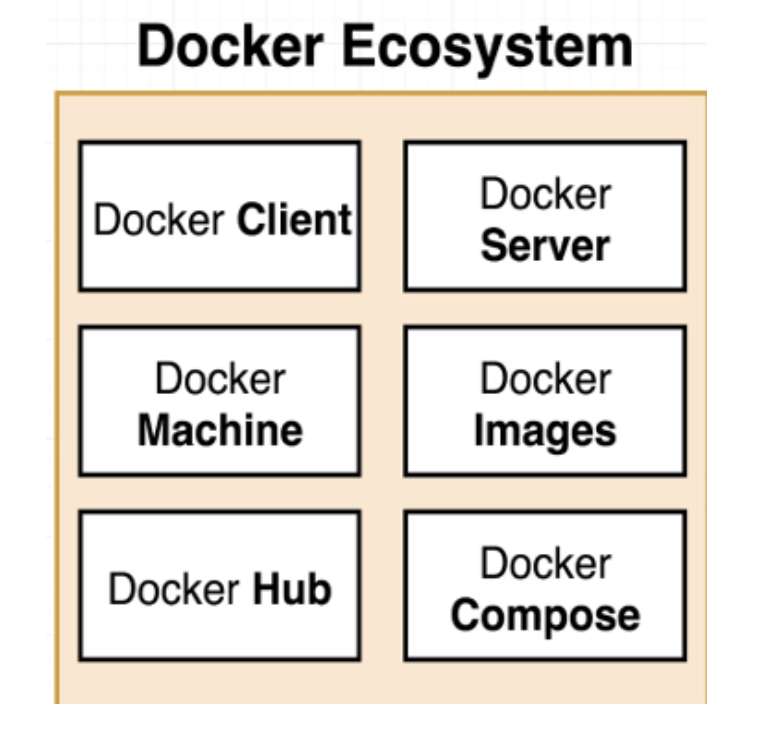

# Docker ecosystem
* Anytime you see someone who refer docker in blog post, article or forum they might referring to many terminologies like
- docker images
- dcoker hub
- docker compose
- docker build
- docker server/client

* However these are tools which comes together to form a platform or ecosystem to create and run something called containers.
* Well your next question would be what is the container as we are speaking a lot about it ? Lets see about it in details.
