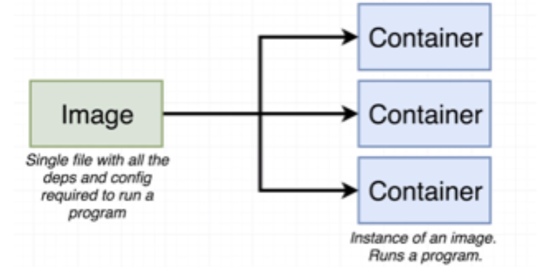
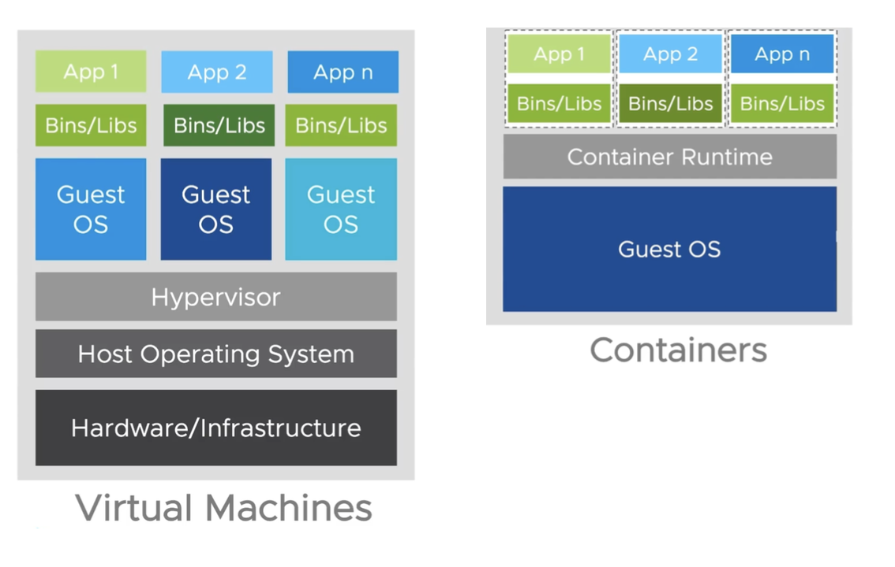

# Container
* Basically, you have an single file called image with all the dependencies and software installed and ready
* This single file is going to store in your local machine
* At some point of time you can use this image to create some thing called container
* The container is an instance of an image, which is going to run your application

# Difference between Virtual Machine and Container
* It's an unfair comparison to compare VM's to Containers because they work together quiet commonly

