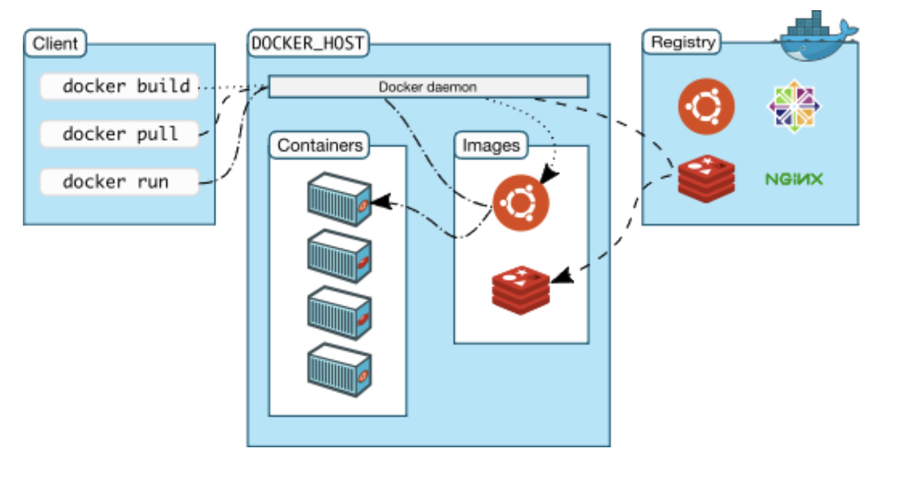

# Docker Architecture

- Docker basically works in Server-Client model
- Once docker is installed you can just run command
  `docker version or docker info`

- Here, Docker demon `dockerd` is going to manage objects such as images, containers, networks and volumes.
- Docker client is the primary way to interact with docker demon `server`
- For example. when you use any docker command the client sends these command to `dockerd` which is going to execute it
- Docker clinet uses an API to connect to the docker daemon

