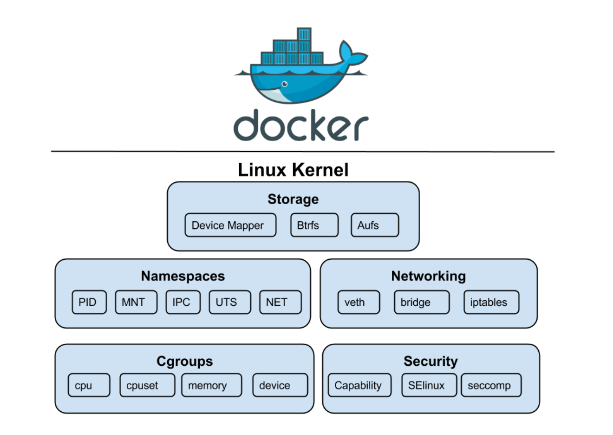

# Features

- once after docker installed it will start utilizing some primary features of linux operating system

# Namespace
- Namespaces is the feature of Linux kernel
- This feature basically helps to tag resource with process
- For instance, while certain set of processes uses one set of resource and another set of process uses another set of resources

# How Namespace is used for Docker?
- Docker creates an isolated environment for the container using this namespaces
- Docker Engine uses namespaces such as the following on Linux.
- `pid` namespace: helps in process isolation `PID: Process ID`
- `net` namespace: helps in managing network interfaces `NET: Networking`
- `ipc` namespace: helps in managing access to IPC resources  ` PC: InterProcess Communication`
- `mnt` namespace: helps in managing filesystem mount points `MNT:  Mount`
- `uts` namespace: helps in isolating kernel and version identifiers `UTS: Unix Timesharing System`

# Cgroups (control group)
- Cgroups is a Linux kernel feature that limits resource usage (CPU, memory, disk I/O, network, etc...) to each processes

# Networking & Security
- Docker also virtualize Network & Security components of base OS
- From Network stand point base OS adapter is going to virtualized
- From Security stand point SELinux of base OS is going to be virtualized

# Container Runtime
- It’s software that runs and manages the components required to run containers
- Docker uses software called `containerd` as runtime
- We have several other container runtime softwares in market such as `CRI-O & RKT`
