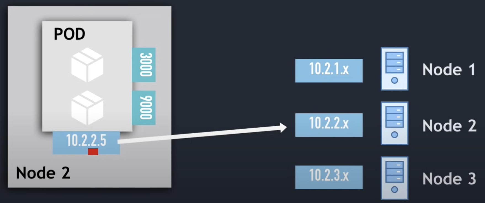
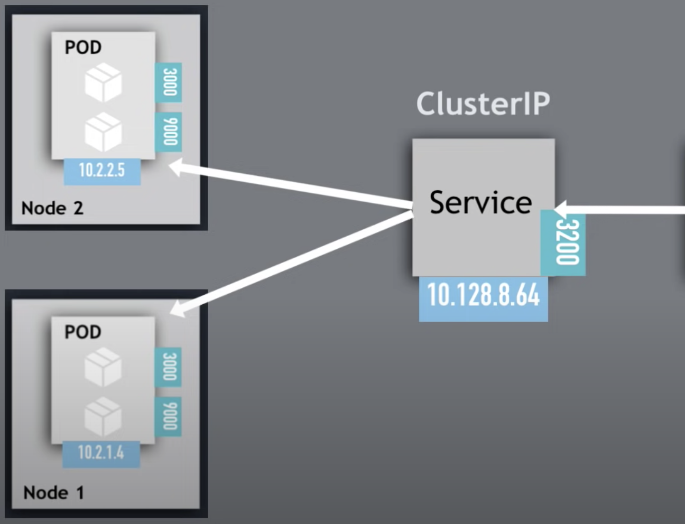

# What is kubernetes serivce and when it is needed?
- In kuberenetes cluster each pod get its own ip address
- Note : Pods in kubernetes are `Ephemeral` which means those are tend to get destroyed frequently
- Eventually when pod gets recreated it will be assigned with new ip address
- Hence, it doesn't make sense to use pod ip address as primary 
- Else we will end up in adjusting the ip address everytime when pod get recreated

- The solution for this problem would be `services`
- Through help of services we can have a static ip address which stays even when pod dies
- Hence services are good solution to loose coupling the components of cluster

# How service works?
- As we know pods will be assigned randomly in worker nodes
- Also, pods ip addresses will be assigned from Node's ip range
- Eventually we can see the ip addresses using `kubectl get pos -o wide`

- Now this ip address cannot be used as primary as because pods are ephemeral
- Hence service will be an virtual abstraction which will be taking traffic from outside and routing to pods

# Questions would raise in mind?
- Now next question would be 
  * how pods are identified by service?
    - This happens with help of `selector` 
    - End pods are identifed via `selector`
    - Note: 
      all labels of pods must matched with service `selector`
      if incase some labels are not matching that pods will not be registered with service
  * which port to forward?
    - This happens with help of argument called `targetPort`

# Notes
- Once after service is created, this object can be monitored with help of command
  `kubectl get endpoints`
- Kuberenets will use this to track of which pods are the members of service
- Since this is dynamic, while pod get recreated it automatically updates the endpoint services